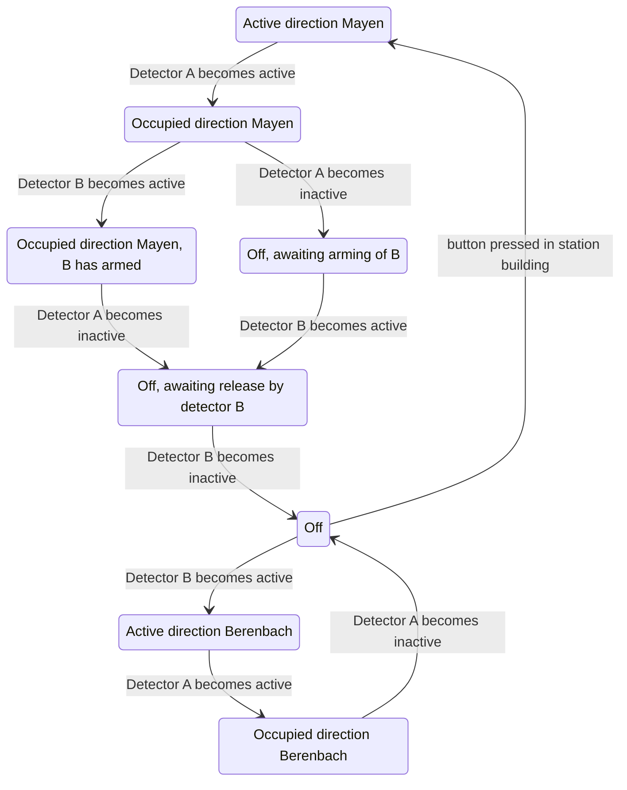

# State diagram 'Berenbach' level crossing

The two IR detectors can be reasonably quick to detect the train entering and
somewhat slower to detect the train leaving to give some margin of safety. And
ideally a waiting period before it "arms" again.

- Detector A is just to the right of the level crossing.
- Detector B is near the Monreal tunnel.



Pseudocode for the main loop:

```python
# Per state, look at which transition is possible (and ignore the rest)
if state == off:
    # Two actions are possible, "off --> b1"  and "off -> m1".
    if sensor_b == active:
        state = b1
    if button_in_station_building == pressed:
        state = m1

if state == b1:
    if sensor_a == active:
        state = b2
# etc etc etc

# Once the state is known, activate/deactivate the level crossing.
if state in [off, m3b, m3c]:
    level_crossing = blinking
else:
    level_crossing = quiet
```
