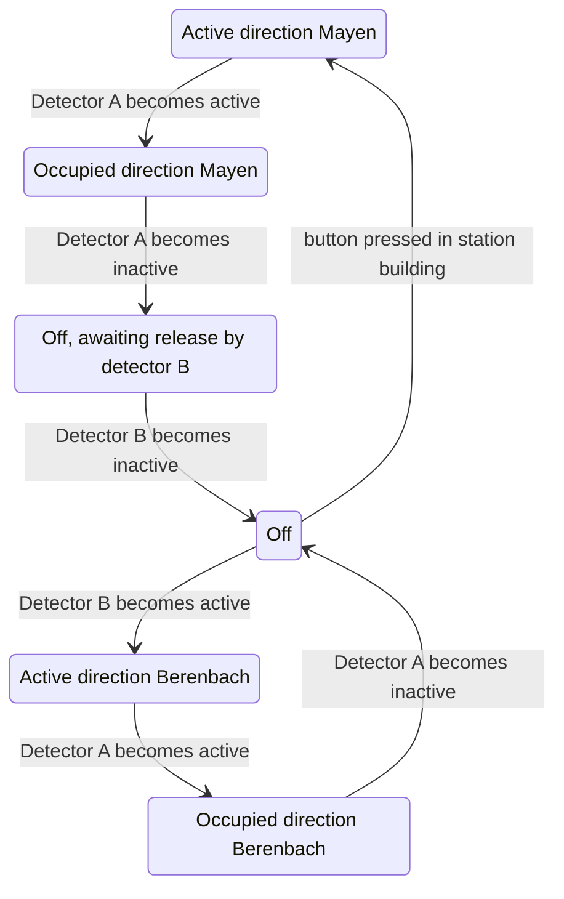

# State diagram 'Berenbach' level crossing

The two IR detectors can be reasonably quick to detect the train entering and
somewhat slower to detect the train leaving to give some margin of safety. And
ideally a waiting period before it "arms" again.

- Detector A is just to the right of the level crossing.
- Detector B is near the Monreal tunnel.



Pseudocode for the main loop:

```python
# Handle events
if 'detector A becomes active' and state==off:
    state = m1
if 'detector A becomes inactive' and state==m1:
    state = m2
if ...

# Handle state
if state in [m1, m2, b1, b2]:
    overweg == aan
else:
    overweg == uit

```

Potential LED lights:

- Overweg aan/uit
- Naar M
  - m1: aan
  - m2: knipper
  - m3: 30%
- Naar B:
  - b1: aan
  - b2: knipper
- Detector A en B (2x)
  - Actieve detectie: 100%
  - Aan: 70%
  - Arming period: 30%
