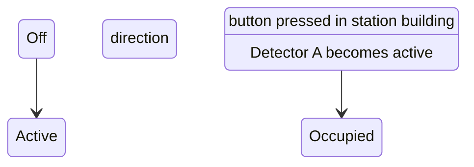

# State diagram 'Berenbach' level crossing

The two IR detectors can be reasonably quick to detect the train entering and
somewhat slower to detect the train leaving to give some margin of safety. And
ideally a waiting period before it "arms" again.

